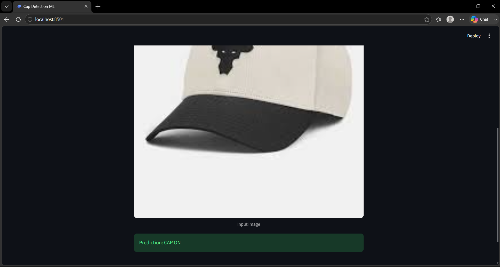
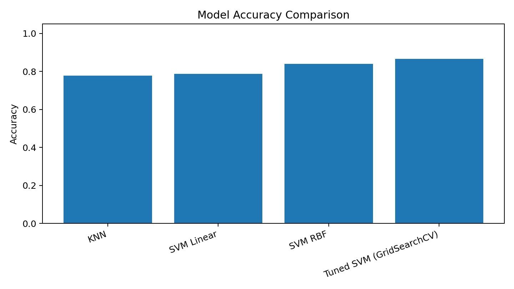
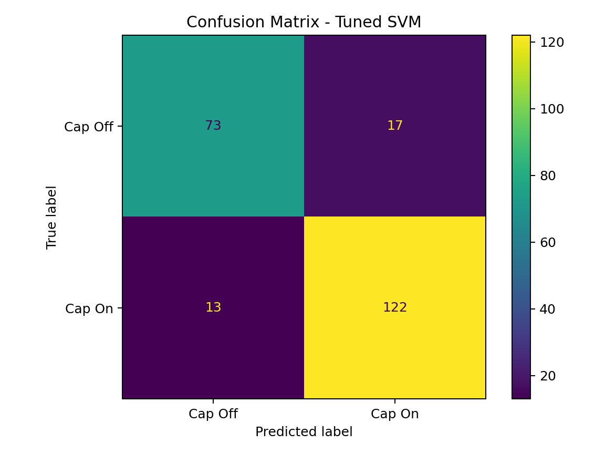

# Image-Based Cap Classification using Machine Learning

A binary image classifier that predicts whether a person in an image is wearing a cap (**Cap On** or **Cap Off**), built with classical machine learning (KNN and SVM) and deployed as a Streamlit web app.

Built as the project for my Machine Learning internship at EISystems Services.

## Demo



## Results

Trained on 1,121 images (671 Cap On, 450 Cap Off) with a stratified 80:20 split. The held-out test set has 225 images.

| Model | Accuracy | Precision | Recall | F1 |
|---|---|---|---|---|
| KNN (k=5) | 77.78% | 89.72% | 71.11% | 79.34% |
| SVM (linear) | 78.67% | 84.25% | 79.26% | 81.68% |
| SVM (RBF) | 84.00% | 84.14% | 90.37% | 87.14% |
| **Tuned SVM (GridSearchCV)** | **86.67%** | **87.77%** | **90.37%** | **89.05%** |

- Best parameters: `C=10`, `kernel=rbf`, `gamma=scale`
- 5-fold cross-validation accuracy of the tuned SVM: **88.06%**





## How it works

1. Read each image with OpenCV and convert it to grayscale
2. Resize to 32 x 32 and flatten into a 1,024-value feature vector
3. Normalize pixel values to the range 0 to 1
4. Standardize features with `StandardScaler` (inside a scikit-learn `Pipeline`, so the test set never influences scaling)
5. Compare KNN, linear SVM and RBF SVM using 5-fold cross-validation
6. Tune the SVM with `GridSearchCV` (C, kernel, gamma)
7. Evaluate on the held-out test set and save the best model with Joblib
8. Serve predictions through a Streamlit app

Labels come from the YOLO-format annotation files in the dataset, converted to a binary cap / no-cap label.

## Tech stack

Python, OpenCV, NumPy, scikit-learn, Matplotlib, Joblib, Streamlit

## Project structure

```
.
├── download_dataset.py   # downloads the public dataset
├── train_model.py        # preprocessing, training, tuning, evaluation
├── app.py                # Streamlit prediction app
├── requirements.txt
├── images/               # screenshots and result plots used in this README
└── docs/                 # internship project report (PDF)
```

## Run it locally

```bash
pip install -r requirements.txt
python download_dataset.py
python train_model.py
streamlit run app.py
```

`train_model.py` writes metrics, plots and the trained model to `outputs/` and `models/`. The app needs the trained model, so run training first.

## Dataset

This project uses the public [ravee360/Cap-detection](https://github.com/ravee360/Cap-detection) dataset. The dataset is not included in this repository. It is downloaded by `download_dataset.py`. Of the images in the source repository, 1,121 were usable in my run.

## Limitations

- Flattened pixel features do not capture shapes, edges or spatial structure the way a CNN does
- Performance can vary with lighting, pose, background, cap style and camera quality
- It is a classifier, so it does not locate the cap with a bounding box
- The dataset is small and public, so results are not a production benchmark

## Future work

- Larger and more varied training data, with augmentation
- HOG features or a convolutional neural network
- Live camera inference and prediction confidence in the app

## Author

Muskan Muchan
[LinkedIn](https://www.linkedin.com/in/muskan-muchan-82356a327) | [GitHub](https://github.com/frivolousmile)
